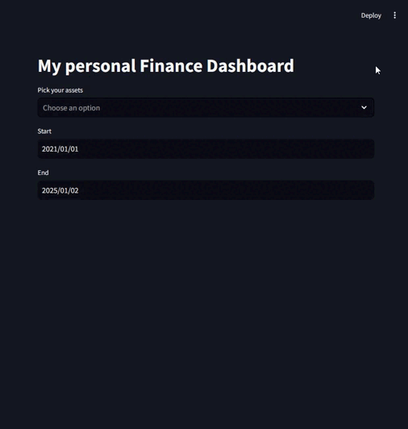

# Finance Dashboard

A Streamlit web app for tracking and visualizing multiple financial assets.

## Technologies


## Preview


## Features
- Multi-asset selection
- Custom date range
- Relative returns calculation
- Interactive line charts
- Progress tracking

## Setup
```bash
pip install streamlit yfinance pandas
streamlit run app.py
